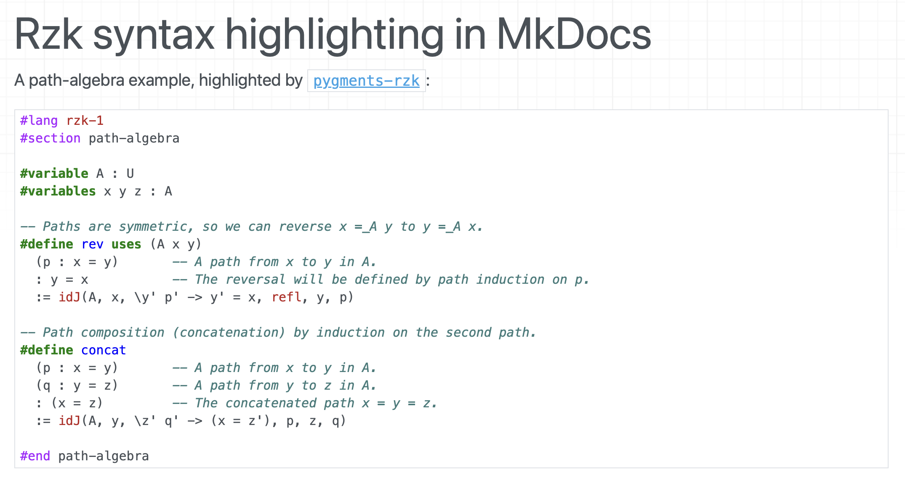

# Pygments higlighter for Rzk

This is a simple [Pygments](https://pygments.org) higlighter for [Rzk](https://github.com/rzk-lang/rzk), which can be used with [`minted` package](https://www.ctan.org/pkg/minted) when writing rzk code in LaTeX or with [MkDocs](https://www.mkdocs.org) to highlight code in blocks when rendering literate Rzk Markdown files.

## How to use

### Install

Clone this repository, and install the highlighter using [`pip` installer](https://pip.pypa.io/en/stable/):

```sh
git clone https://github.com/rzk-lang/pygments-rzk.git
cd pygments-rzk   # enter repository root
pip install .     # install using pip
```

### Use in MkDocs

Once `pygments-rzk` is installed in the same Python environment as MkDocs,
Pygments will recognise `rzk` fenced code blocks automatically. The only thing
your MkDocs project needs is a Markdown extension that routes code blocks
through Pygments — the built-in `codehilite` extension is enough:

```yaml
# mkdocs.yml
site_name: My Rzk docs

markdown_extensions:
  - codehilite
```

Then write Rzk in fenced blocks tagged `rzk` (see
[demo/mkdocs/docs/index.md](demo/mkdocs/docs/index.md) for a full example):

````md
```rzk
#lang rzk-1
...
```
````

A runnable demo lives in [demo/mkdocs/](demo/mkdocs/) — `cd demo/mkdocs && mkdocs serve`.



### Use in Command Line (Terminal)

You can simply pass text to `pygmentize -l rzk`, e.g.:

```sh
cat demo/demo.rzk | pygmentize -l rzk
```


### Use in LaTeX (via `minted`)

In your LaTeX document:

1. Include `minted` package:

```tex
\package{minted}
```

2. Use `minted` environment with `rzk` language, for example (see [demo/demo.tex](demo/demo.tex) for full example):

```tex
\begin{minted}[linenos,frame=leftline,mathescape]{rzk}
...
\end{minted}
```


